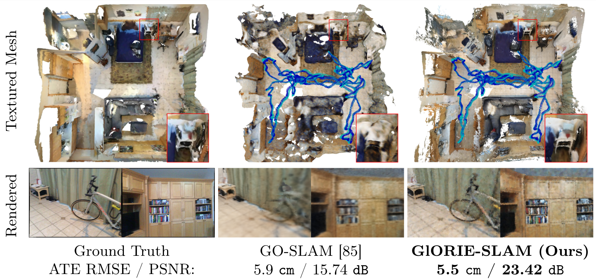

<!-- PROJECT LOGO -->
  <h1 align="center">GlORIE-SLAM: Globally Optimized RGB-only Implicit Encoding Point Cloud SLAM</h1>
  <p align="center">
    <a href="https://ganlinzhang.xyz" target="_blank"><strong>Ganlin Zhang<sup>1</sup>*</strong></a>
    ·
    <a href="https://eriksandstroem.github.io/" target="_blank"><strong>Erik Sandström<sup>1</sup>*</strong></a>
    ·
    <a href="https://youmi-zym.github.io/" target="_blank"><strong>Youmin Zhang<sup>2,3</sup></strong></a>
    ·
    <a href="https://manthan99.github.io/" target="_blank"><strong>Manthan Patel<sup>1</sup></strong></a>
    <br>
    <a href="https://vision.ee.ethz.ch/people-details.OTAyMzM=.TGlzdC8zMjcxLC0xOTcxNDY1MTc4.html" target="_blank"><strong>Luc Van Gool<sup>1,4,5</sup></strong></a>
    ·
    <a href="https://cvg.ethz.ch/team/Dr-Martin-R-Oswald" target="_blank"><strong>Martin R. Oswald<sup>1,6</sup></strong></a>
  </p>
  <p align="center">
      <strong><sup>1 </sup>ETH Zurich,  <sup>2 </sup>University of Bologna, <sup>3 </sup>Rock Universe, <sup>4 </sup>KU Leuven, <sup>5 </sup>INSAIT, <sup>6 </sup>University of Amsterdam</strong>
      <br>(<strong>*</strong> Equal Contribution)
      <strong><h4 align="center"><a href="https://arxiv.org/abs/2403.19549" target="_blank">Paper</a> | <a href="https://ganlinzhang.xyz/GlORIE-SLAM/" target="_blank">Project Website</a></h4></strong>
  </strong></p>
    


<p align="center">
    
</p>

<p align="center">
<strong>GlORIE-SLAM</strong> produces accurate dense geometry and camera tracking on large-scale indoor scenes thanks to our <strong>deformable scene representation</strong> and <strong>DSPO layer</strong>.
</p>

<p align="center">
    
</p>

<strong>GlORIE-SLAM</strong> uses a deformable point cloud as the scene representation and achieves lower trajectory error and higher rendering accuracy compared to competitive approaches.


<p align="center">
    
</p>
<p align="center">
GlORIE-SLAM Architecture.
</p>

<!-- TABLE OF CONTENTS -->
<details open="open" style='padding: 10px; border-radius:5px 30px 30px 5px; border-style: solid; border-width: 1px;'>
  <summary>Table of Contents</summary>
  <ol>
    <li>
      <a href="#installation">Installation</a>
    </li>
    <li>
      <a href="#run">Run</a>
    </li>
    <li>
      <a href="#acknowledgement">Acknowledgement</a>
    </li>
    <li>
      <a href="#citation">Citation</a>
    </li>
    <li>
      <a href="#contact">Contact</a>
    </li>
  </ol>
</details>


## Installation
1. Clone the repo using the `--recursive` flag 
```bash
git clone --recursive https://github.com/zhangganlin/GlORIE-SLAM.git
cd GlOIRE-SLAM
```

2. Creating a new conda environment using the provided `glorie_env.yaml` file.
> Notice that if you are running GlORIE-SLAM on a cluster GPU without a display, we recommend installing the headless version of Open3D which is required to evaluate the depth L1 metric of the reconstructed mesh. This requires compiling Open3D from scratch. If that, remove the Open3D dependency from the `glorie_env.yaml` file. The code is tested with Open3D 0.16.0. 
```bash
conda env create -f glorie_env.yaml
conda activate glorie-slam
```
3. Compile and install thirdparty libraries.
```bash
pip install thirdparty/evaluate_3d_reconstruction_lib
python setup.py install
```

4. Download pretrained model.
Download the pretained models from [Google Drive](https://drive.google.com/file/d/1oZbVPrubtaIUjRRuT8F-YjjHBW-1spKT/view?usp=drive_link), unzip them inside the `pretrained` folder.
<details>
  <summary>[Directory structure of pretrianed (click to expand)]</summary>
  
```bash
  .
  └── pretrained
        ├── .gitkeep
        ├── droid.pth
        ├── middle_fine.pt
        └── omnidata_dpt_depth_v2.ckpt

```
</details>

## Data Download

### Replica
Download the data as below and the data is saved into the `./datasets/Replica` folder. Note that the Replica data is generated by the authors of iMAP (but hosted by the authors of NICE-SLAM). Please cite iMAP if you use the data.
```bash
bash scripts/download_replica.sh
```
To be able to evaluate the reconstruction error, download the ground truth Replica meshes where unseen region have been culled.

```bash
bash scripts/download_cull_replica_mesh.sh
```

### TUM-RGBD
```bash
bash scripts/download_tum.sh
```
DATAROOT is `./datasets` by default. Please change the `input_folder` path in the scene specific config files if stored somewhere else on your machine.


### ScanNet
Please follow the data downloading procedure on the [ScanNet](http://www.scan-net.org/) website, and extract color/depth frames from the `.sens` file using this [code](https://github.com/ScanNet/ScanNet/blob/master/SensReader/python/reader.py).

<details>
  <summary>[Directory structure of ScanNet (click to expand)]</summary>
  
  DATAROOT is `./datasets` by default. If a sequence (`sceneXXXX_XX`) is stored in other places, please change the `input_folder` path in the config file or in the command line.

```
  DATAROOT
  └── scannet
        └── scene0000_00
            └── frames
                ├── color
                │   ├── 0.jpg
                │   ├── 1.jpg
                │   ├── ...
                │   └── ...
                ├── depth
                │   ├── 0.png
                │   ├── 1.png
                │   ├── ...
                │   └── ...
                ├── intrinsic
                └── pose
                    ├── 0.txt
                    ├── 1.txt
                    ├── ...
                    └── ...
```
</details>


We use the following sequences: 
```
scene0000_00
scene0054_00
scene0059_00
scene0106_00
scene0169_00
scene0181_00
scene0207_00
scene0233_00
```


## Run
For running GlORIE-SLAM, we recommend using [weights and biases](https://wandb.ai/) for the logging. This can be turned on by setting the `wandb` flag to True in the `configs/*.yaml` file. Also make sure to specify the path `wandb_folder`. If you don't have a wandb account, first create one. Each scene has a config folder, where the `input_folder`,`output` paths need to be specified. Below, we show some example run commands for one tiny scene from each dataset.

### Replica
To run GlORIE-SLAM on the `office0` scene, run the following command. 
```bash
python run.py configs/Replica/demo_office0.yaml
```
After reconstruction, the trajectory error will be evaluated and so will the mesh accuracy along with the rendering metrics.

### TUM-RGBD
To run GlORIE-SLAM on the `freiburg3_office` scene, run the following command. 
```bash
python run.py configs/TUM_RGBD/demo_freiburg3_office.yaml
```
After reconstruction, the trajectory error will be evaluated automatically.

### ScanNet

To run GlORIE-SLAM on the `scene0000_00` scene, run the following command. 
```bash
python run.py configs/Scannet/demo_scene0000.yaml
```
After reconstruction, the trajectory error will be evaluated automatically.

## Run tracking without mapping
Our GlORIE-SLAM pipeline uses two processes for tracking and mapping, and it is possible to run tracking only without mapping/rendering. In case you only want to test the `DSPO` part of our paper, add `--only_tracking`in each of the above commands.
```bash
python run.py configs/Replica/demo_office0.yaml --only_tracking
python run.py configs/TUM_RGBD/demo_freiburg3_office.yaml --only_tracking
python run.py configs/Scannet/demo_scene0000_00.yaml --only_tracking
```

## Acknowledgement
Our codebase is partially based on [Point-SLAM](https://github.com/eriksandstroem/Point-SLAM), [GO-SLAM](https://github.com/youmi-zym/GO-SLAM) and [DROID-SLAM](https://github.com/princeton-vl/DROID-SLAM), we thank the authors for making these codebases publicly available. Our work would not have been possible without your great efforts!

## Reproducibility
There may be minor differences between the released codebase and the results reported in the paper. Further, we note that the GPU hardware has an influence, despite running the same seed and conda environment.

## Citation

If you find our code or paper useful, please cite
```bibtex
@article{zhang2024glorie,
  title={Glorie-slam: Globally optimized rgb-only implicit encoding point cloud slam},
  author={Zhang, Ganlin and Sandstr{\"o}m, Erik and Zhang, Youmin and Patel, Manthan and Van Gool, Luc and Oswald, Martin R},
  journal={arXiv preprint arXiv:2403.19549},
  year={2024}
}
```
## Contact
Contact [Ganlin Zhang](mailto:zgl0315@gmail.com) and [Erik Sandström](mailto:erik.sandstrm@gmail.com) for questions, comments and reporting bugs.

